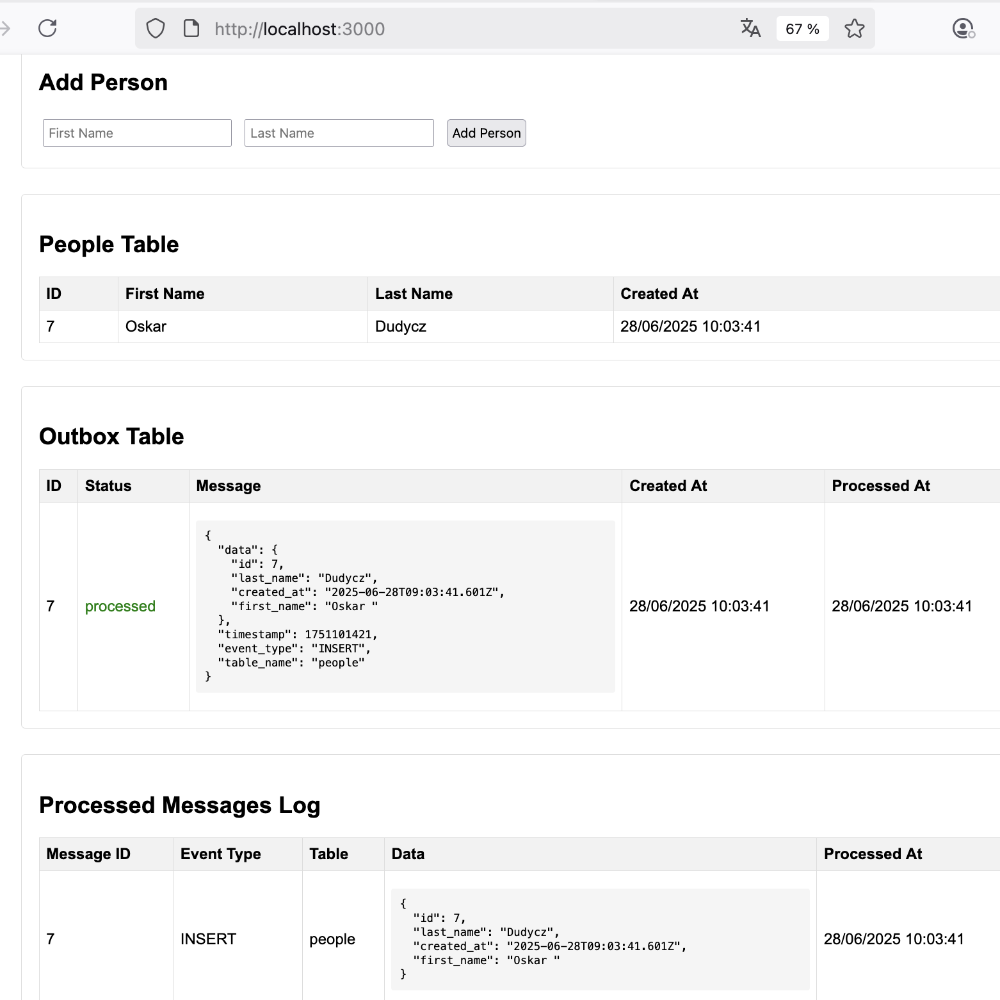

# Outbox Pattern Demo with PostgreSQL Logical Replication

This is a minimalist example of implementing the outbox pattern with Postgres (using push-based logical replication rather than polling) in TypeScript inspired by [Oskar Dudycz's .NET example](https://event-driven.io/en/push_based_outbox_pattern_with_postgres_logical_replication/).

Key elements:

1. Create outbox table - `setup-database.sh`
2. Create replication slot - `setup-database.sh`
3. Create publication - `setup-database.sh` (this can also be done in code)
4. Configure replication slot - `outbox-processor.ts`
5. Subscribe to and process messages - `outbox-processor.ts`

This sample application writes to `outbox-processed.log` and `outbox-errors.log`. You can test the functionality by running the app which will allow you to add business data (to the people table) and see the corresponding updates to the outbox table and processed messages.



## Prerequisites

Before running the setup script, ensure you have:

- **Node.js 18+**
- **PostgreSQL 17** (with Homebrew)
- **TypeScript** (installed globally: `npm install -g typescript`)
- **wal2json extension** for PostgreSQL logical replication

### Required Manual Setup

1. **Install PostgreSQL 17 and wal2json extension:**
   ```bash
   brew install postgresql@17 wal2json
   brew services start postgresql@17
   ```

2. **Configure PostgreSQL for logical replication:**
   ```bash
   # Find your postgresql.conf location first
   psql -d postgres -c "SHOW config_file;"
   
   # Add logical replication settings (replace path with your actual config file path)
   echo "wal_level = logical
   max_replication_slots = 4
   max_wal_senders = 4" >> /opt/homebrew/var/postgresql@17/postgresql.conf
   ```

3. **Restart PostgreSQL:**
   ```bash
   brew services restart postgresql@17
   ```

4. **Create PostgreSQL user and database:**
   ```bash
   createuser -s postgres
   createdb outbox_demo -O postgres
   ```

5. **Ensure PostgreSQL user has replication privileges:**
   ```bash
   psql -d postgres -c "ALTER USER postgres REPLICATION;"
   ```

**Note:** If you encounter "already exists" errors for publications or replication slots when running the app multiple times, you can clean them up with:
```bash
psql -d outbox_demo -c "DROP PUBLICATION IF EXISTS outbox_publication;"
psql -d outbox_demo -c "SELECT pg_drop_replication_slot('outbox_slot');" 2>/dev/null || true
```

## Quick Setup

Run the automated setup script:

```bash
./setup.sh
```

This script will:
- Install Node.js dependencies
- Check PostgreSQL connection
- Create the database if needed
- Verify PostgreSQL is configured for logical replication
- Set up database schema and replication slots
- Build the application
- Create environment configuration file

Then start the application:
```bash
npm start
```

Visit `http://localhost:3000`

## Manual Setup (if needed)

If you prefer manual setup or the script fails:

1. **Install dependencies:** `npm install`
2. **Restart PostgreSQL**
3. **Create database:** `createdb outbox_demo`
4. **Set up schema:** `npm run setup-db`
5. **Build:** `npm run build`
6. **Start:** `npm start`

## Configuration

The application supports environment variables for database configuration. Copy `.env.example` to `.env` and modify as needed:

```bash
DB_HOST=localhost
DB_PORT=5432
DB_USER=postgres
DB_PASSWORD=postgres
DB_NAME=outbox_demo
```

Default settings (if no environment variables are set):
- Host: localhost
- Port: 5432
- Database: outbox_demo
- User: postgres
- Password: postgres

## API Endpoints

- `GET /` - Web UI
- `POST /api/people` - Add a new person
- `GET /api/people` - Get all people
- `GET /api/outbox` - Get outbox messages
- `GET /api/processed` - Get processed message log